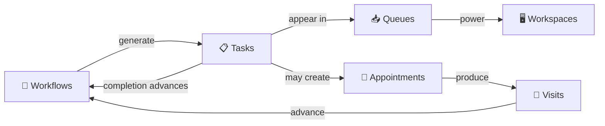
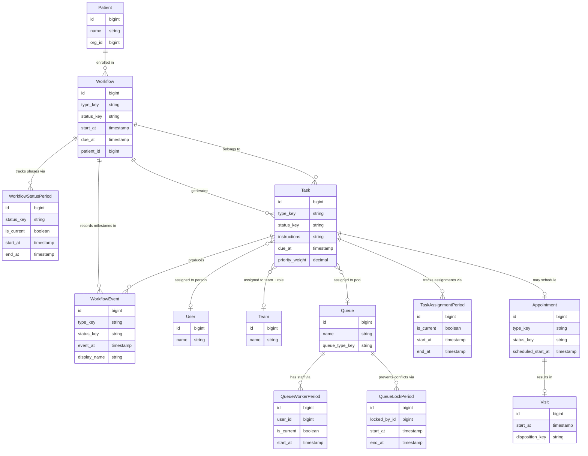

# Platform Concepts — Executive Summary

This directory contains conceptual documentation for the care coordination platform. These documents explain **what the platform does and why**, written for stakeholders, product teams, and implementation partners — not as code-level reference.

---

## The Platform in One Paragraph

The platform orchestrates multi-step, multi-role care processes for healthcare organizations operating under value-based care arrangements. It moves patients through structured **workflows**, generates **tasks** for the right staff at the right time, distributes work through role-specific **queues**, and provides each team member with a unified **workspace** — all while maintaining the audit trail that payers, regulators, and quality teams require.

---

## Table of Contents

| Document                                | Summary                                                                                                                                                                                                                                                                                                                                       |
| --------------------------------------- | --------------------------------------------------------------------------------------------------------------------------------------------------------------------------------------------------------------------------------------------------------------------------------------------------------------------------------------------- |
| [Workflows](./workflows.md)             | The core orchestration engine. Workflows move patients through defined care phases — intake, evaluation, documentation, submission — generating work items at each step and tracking every transition with timestamps. Organizations define their own care processes; the platform enforces sequencing and handles progression automatically. |
| [Tasks](./tasks.md)                     | The unit of work. Each task answers _what_ needs to be done, _who_ should do it, _when_ it is due, and _what happened_. Tasks can be assigned to a specific person, a role on the patient's care team, or a shared pool. Most are generated automatically as workflows advance.                                                               |
| [Queues](./queues.md)                   | Work distribution. Queues filter and prioritize the full set of active tasks into role-specific views — a care guide sees outreach visits, a triage nurse sees escalations, a records specialist sees retrieval requests. Shared queues use locking to prevent duplicate effort.                                                              |
| [Workspaces](./workspaces.md)           | The daily interface. A workspace combines a staff member's queue, patient context, and task actions into a single screen. Staff open their workspace, see prioritized work, perform it, and move on — no switching between disconnected systems.                                                                                              |
| [Appointments](./appointments.md)       | Scheduling and visit management. Appointments are created from tasks, carry role-aware participants that auto-resolve when team assignments change, support recurring series, and produce visit records that feed outcomes back into workflows.                                                                                               |
| [ACD / HCC Coding](./acd-hcc-coding.md) | Risk adjustment and diagnosis documentation. Supports the full annual HCC coding cycle — from prior-year claims import through CDI specialist review, clinician validation, code assignment, and gap tracking — for organizations under capitated payment models.                                                                             |

---

## How It All Connects

**Workflows** define the care process. As a workflow advances through phases, it generates **tasks** — each routed to the right person or role. Staff discover and work tasks through **queues** that filter by role and sort by priority. **Workspaces** wrap queues with patient context and action tools into a unified daily experience. Tasks frequently produce **appointments**, which result in **visits** whose outcomes feed back into workflows, closing the loop.

---

## Data Model — Workflows, Tasks & Queues

The diagram below shows the primary entities that power workflow orchestration, task management, and queue-based work distribution. It is intentionally simplified to the first-order relationships a customer needs to understand — lookup/configuration tables and audit fields are omitted for clarity.

### Reading the Diagram

| Entity                   | Role                                                                                                                                            |
| ------------------------ | ----------------------------------------------------------------------------------------------------------------------------------------------- |
| **Patient**              | The individual receiving care. Each patient can be enrolled in multiple concurrent workflows.                                                   |
| **Workflow**             | A structured care process (e.g., benefits eligibility, outreach). Moves through phases tracked by status periods.                               |
| **WorkflowStatusPeriod** | Records each phase the workflow passes through, with precise timestamps — the audit trail for care progression.                                 |
| **Task**                 | A unit of work generated by a workflow phase. Assigned to a person, a team role, or a shared queue. Carries priority weight for queue ordering. |
| **TaskAssignmentPeriod** | Tracks every assignment and reassignment over time. Supports workload analysis and SLA reporting.                                               |
| **WorkflowEvent**        | A milestone or outcome recorded during the workflow — assessment results, evaluation findings, documentation decisions.                         |
| **Queue**                | A named work pool that tasks can be routed to. Staff are added as workers; locking prevents two people from claiming the same task.             |
| **Appointment / Visit**  | Tasks can produce scheduled appointments. Completed appointments produce visit records whose outcomes feed back into workflow progression.      |

### Three Assignment Models

Tasks support three mutually exclusive assignment paths, visible in the diagram:

1. **Direct → User** — assigned to a specific person
2. **Role-based → Team** — assigned to a role on the patient's care team; resolves to whoever holds that role
3. **Pool-based → Queue** — placed in a shared queue where any qualified worker can claim it

This flexibility lets the platform adapt to different organizational structures without code changes.
