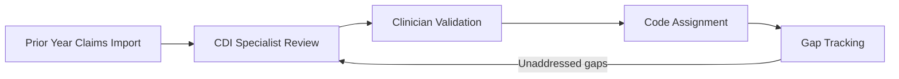

# Risk Adjustment and Diagnosis Documentation

The platform supports the full cycle of HCC coding — from prior-year claims import through CDI specialist review, clinician validation, code assignment, and gap tracking — for organizations operating under value-based care arrangements.

---

## Why This Matters

Inaccurate or incomplete diagnosis coding means lost revenue under capitated payment models and care plans that don't reflect the patient's actual clinical complexity. The platform closes this gap by giving CDI specialists and clinicians a shared, auditable workflow for validating diagnoses before submission deadlines.

---

## What HCC Coding Is

Hierarchical Condition Category (HCC) coding is the process of documenting and coding patient diagnoses to accurately reflect their medical complexity. In Medicare Advantage and Medicaid managed care, accurate diagnosis documentation directly affects capitation payments. Each documented condition maps to an HCC category with an associated risk weight. A patient's total risk score — the sum of their HCC weights — determines the reimbursement the health plan receives for that patient's care.

Beyond reimbursement, accurate coding ensures care plans reflect the patient's actual clinical picture. A patient whose chronic conditions are fully documented receives care resources appropriate to their complexity.

---

## The Annual Coding Cycle

HCC coding follows a calendar-year cycle. Each year, previously documented diagnoses must be revalidated — a diagnosis coded last year does not automatically carry forward. The platform supports each stage of this annual process.

### Stage 1: Data Import

Prior-year diagnosis data is imported from claims feeds. The platform maps each diagnosis to its ICD-10 code and corresponding HCC category, then associates these with the appropriate patients. Categories are flagged based on the available evidence:

| Evidence State | Meaning                                                                                                 |
| -------------- | ------------------------------------------------------------------------------------------------------- |
| Suspect        | Prior-year data suggests the condition may still be present this year                                   |
| Recapture      | Coded evidence exists from the prior two years                                                          |
| New            | A condition documented for the first time in the current year, without prior evidence in system history |

This import creates the starting inventory of diagnoses that need to be addressed during the year.

### Stage 2: CDI Specialist Review

CDI (Clinical Documentation Improvement) specialists review patients who have upcoming visits. For each patient, they examine the imported diagnosis data, identify which conditions need clinician validation, and prepare review materials. The CDI specialist then publishes their review, making it visible to the clinician who will see the patient.

CDI specialists work from a dedicated [queue](./queues.md) that surfaces patients with upcoming appointments and outstanding suspected diagnoses, prioritized by visit date and diagnosis value.

### Stage 3: Clinician Validation

During the patient visit, the clinician sees the CDI specialist's prepared review — the list of suspected diagnoses that need to be addressed. For each diagnosis, the clinician determines:

| Determination    | Result                                                                                                                     |
| ---------------- | -------------------------------------------------------------------------------------------------------------------------- |
| Present          | The condition is current and documented in the visit note                                                                  |
| Not present      | The condition is no longer applicable. It is marked accordingly.                                                           |
| Unable to assess | The condition cannot be evaluated at this visit. It remains open for a future encounter, or additional testing is ordered. |

Each validation decision is recorded with the clinician, the visit, and the timestamp.

### Stage 4: Code Assignment

After the visit, the CDI specialist reviews the clinician's documentation and assigns specific ICD-10 codes based on the documented evidence. Codes are submitted for billing.

Capture outcomes at the individual diagnosis level roll up to the category level. When a category is captured, the platform evaluates domination rules — certain HCC categories supersede others when both are documented. Only captured categories can dominate, preventing partial documentation from incorrectly suppressing valid conditions.

### Stage 5: Gap Tracking

Throughout the year, the platform tracks which HCC categories have been addressed and which remain outstanding. Gap tracking provides visibility into:

| Gap Type                      | Significance                                                                                                     |
| ----------------------------- | ---------------------------------------------------------------------------------------------------------------- |
| Unaddressed categories        | Conditions that have evidence but have not yet been validated by a clinician                                     |
| High-value gaps               | HCC categories with the highest risk weights, where documentation has the greatest financial and clinical impact |
| Progress toward capture goals | What percentage of suspected conditions have been addressed? How does this compare to organizational targets?    |

Outstanding gaps cycle back to CDI specialist review for the next patient visit, creating a continuous loop through the calendar year.

---

## Evidence and Audit Trail

Every step in the coding process is recorded:

| Record               | What Is Captured                                                       |
| -------------------- | ---------------------------------------------------------------------- |
| Diagnosis review     | Which CDI specialist reviewed it, when, and what they noted            |
| Clinician validation | Present, not present, or deferred, with the associated visit           |
| Code assignment      | The specific ICD-10 code, who assigned it, and the supporting evidence |
| Capture attempt      | Whether validation was successful or not, and the outcome              |

This audit trail is critical for CMS compliance. Risk adjustment audits require medical record evidence supporting every HCC claimed. The platform maintains this evidence chain from import through capture, linking each code to the clinical documentation that supports it.

---

## Roles Involved

| Role                    | Responsibilities                                                                                                                                                                                            |
| ----------------------- | ----------------------------------------------------------------------------------------------------------------------------------------------------------------------------------------------------------- |
| CDI Specialist          | Prepares diagnosis reviews before patient visits, reviews clinician documentation after visits, assigns codes, and tracks gaps. Works primarily from a CDI-specific [queue](./queues.md) and gap dashboard. |
| Clinician               | Validates suspected diagnoses during patient encounters. Sees CDI-prepared review materials alongside normal visit documentation.                                                                           |
| Operations / Management | Monitors capture rates, gap closure progress, and coding accuracy across the organization using reporting dashboards.                                                                                       |

---

## Relationship to Other Platform Concepts

| Concept                           | Relationship                                                                                                                                                      |
| --------------------------------- | ----------------------------------------------------------------------------------------------------------------------------------------------------------------- |
| [Workflows](./workflows.md)       | CDI review and gap closure activities are driven by [tasks](./tasks.md) within the platform's task and workflow infrastructure.                                   |
| [Queues](./queues.md)             | CDI specialists work from dedicated queues that surface patients needing review, sorted by visit date and gap value.                                              |
| [Appointments](./appointments.md) | The scheduling system identifies upcoming visits that CDI specialists should prepare for, and visit records link to the diagnoses validated during the encounter. |
