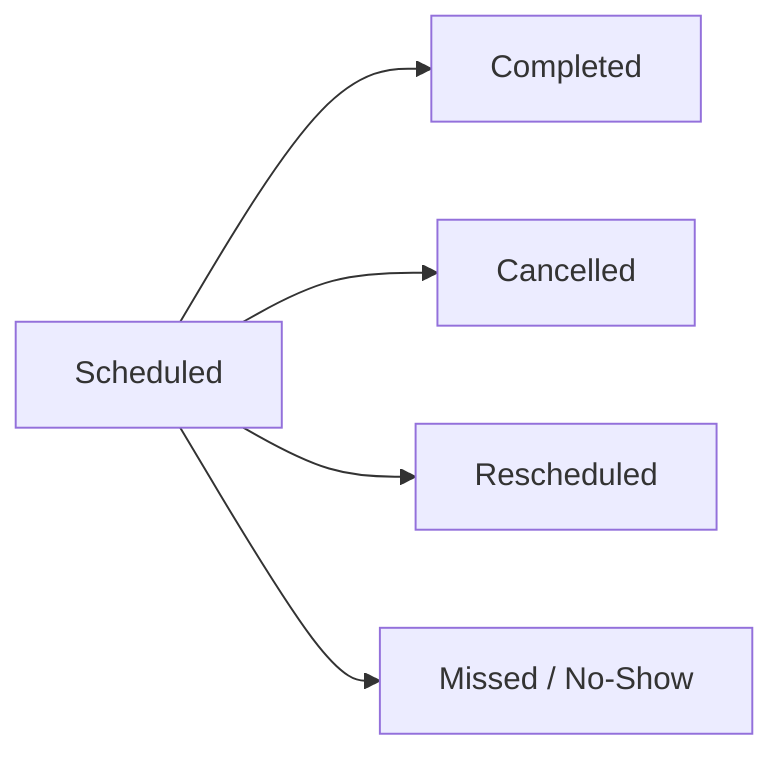
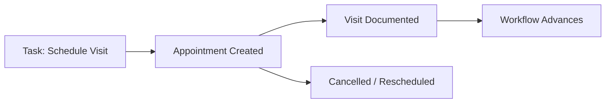

# Appointments — Scheduling and Visit Management

An **appointment** is a scheduled interaction between staff and a patient. The platform manages the full lifecycle of scheduling — from initial booking through completion and documentation — including support for recurring series and multiple participation models.

---

## Why This Matters

Missed visits, scheduling confusion, and disconnected records waste staff time and delay patient care. The platform treats scheduling as an integrated part of care coordination — appointments emerge from care plans, carry role-aware participant assignments, and feed outcomes back into workflows automatically.

---

## What an Appointment Contains

Every appointment has:

| Attribute    | Description                                                                                                                        |
| ------------ | ---------------------------------------------------------------------------------------------------------------------------------- |
| Time         | Scheduled start and end, defining when the interaction is planned                                                                  |
| Type         | The kind of visit (initial assessment, follow-up, care planning session, telehealth check-in). Types are defined per organization. |
| Modality     | How the interaction occurs: in-person, telehealth, or phone                                                                        |
| Participants | The staff and patient involved. Participants can be specific individuals or defined by role (explained below).                     |
| Status       | Where the appointment stands in its lifecycle                                                                                      |
| Patient      | The individual the appointment is for                                                                                              |
| Location     | For in-person visits, the address where the appointment takes place                                                                |

---

## Appointment Lifecycle

Appointments progress through a standard set of statuses:

The platform tracks every status change with timestamps — when an appointment was scheduled, when it was rescheduled (and why), when it was completed, or when it was cancelled (with a cancellation reason). This history supports operational reporting on scheduling patterns, no-show rates, and cancellation trends.

---

## Connection to Tasks and Workflows

Appointments are frequently the result of a [task](./tasks.md). A "schedule engagement visit" task in a [workflow](./workflows.md) leads to creating an appointment. The appointment occurs, producing a documented visit — which in turn may trigger the workflow to advance to its next phase.

This connection means scheduling is not a standalone activity. It is integrated into the broader care coordination process — appointments emerge from care plans and feed outcomes back into them.

---

## Participants

Appointments support two types of participants:

### Specific Participants

A named individual — a particular care guide, nurse practitioner, or specialist — is assigned to the appointment. If that person changes, the appointment must be manually updated.

### Role-Based (Logical) Participants

Instead of naming a specific person, the appointment specifies a role — "the patient's assigned care guide" or "the patient's nurse practitioner." The platform resolves this to the current person holding that role at the time of the appointment.

The advantage: if a patient's care guide changes between when the appointment is scheduled and when it occurs, the appointment automatically reflects the new assignment. Staff do not need to manually update every future appointment when team assignments change.

---

## Recurring Appointments (Series)

Many care interactions follow a recurring pattern — weekly check-ins, biweekly therapy sessions, monthly health assessments. The platform supports this through appointment series.

### How Series Work

A series defines a recurrence pattern (weekly, biweekly, monthly, or custom intervals) along with the appointment template — type, modality, participants, time, and location. The platform generates individual appointment instances automatically, up to twelve months ahead.

### Series Updates

When a series is updated — a time change, a location change, a participant change — the platform applies the change to all future appointments in the series that have not been individually modified. Appointments that staff have already customized (moved to a different time, added a note, changed the location) are preserved as-is. This prevents series-wide updates from overwriting intentional per-appointment adjustments.

### Individual Overrides

Any single appointment within a series can be modified independently. The platform marks it as an override, and future series-wide updates will skip it. This allows staff to handle exceptions (rescheduling one session due to a holiday, changing the location for a specific visit) without disrupting the rest of the series.

---

## Visits — The Record of What Happened

A **visit** is the documentation record created after an appointment occurs. While the appointment represents the plan, the visit represents what actually happened.

A visit captures:

| Field                      | Description                                                                                         |
| -------------------------- | --------------------------------------------------------------------------------------------------- |
| Actual start and end times | When the interaction actually began and ended, which may differ from the scheduled time             |
| Modality                   | How the interaction actually occurred (a telehealth appointment may end up as a phone call)         |
| Disposition                | The outcome: completed, no-show, patient refused, or other dispositions defined by the organization |
| Participants               | Who actually participated, which may differ from who was originally scheduled                       |
| Notes                      | Clinical or operational documentation from the interaction                                          |

Visits can also be created independently of appointments — for unscheduled interactions, walk-ins, or encounters that were not pre-planned.

### Appointment-Visit Link

Every appointment can have at most one visit. The appointment is the plan; the visit is the execution record. This separation allows the platform to report on scheduling adherence — how often do appointments result in completed visits? What is the no-show rate? How do actual visit durations compare to scheduled durations?

---

## Operational Visibility

The scheduling system provides data for operational analysis:

| Metric                            | What It Reveals                                                            |
| --------------------------------- | -------------------------------------------------------------------------- |
| Scheduling volume                 | How many appointments are being scheduled per day, week, or month?         |
| Completion rate                   | What percentage of scheduled appointments result in completed visits?      |
| No-show and cancellation patterns | Which patients, time slots, or modalities have the highest no-show rates?  |
| Scheduling adherence              | Are actual visit times and durations consistent with what was scheduled?   |
| Series utilization                | How many recurring series are active? Are patients attending consistently? |

---

## Relationship to Other Platform Concepts

| Concept                       | Relationship                                                                                                                                                     |
| ----------------------------- | ---------------------------------------------------------------------------------------------------------------------------------------------------------------- |
| [Tasks](./tasks.md)           | Often generate appointments (a "schedule visit" task creates an appointment) and may be generated by appointments (a completed visit triggers a follow-up task). |
| [Workflows](./workflows.md)   | Drive the creation of appointments through task generation and may advance based on visit outcomes.                                                              |
| [Workspaces](./workspaces.md) | Display upcoming appointments alongside tasks, giving staff a complete view of their scheduled and unscheduled work.                                             |
