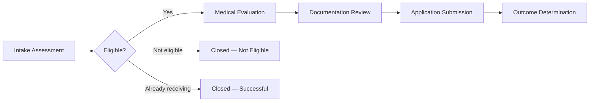

# Workflows — Care Process Orchestration

A **workflow** is a structured care process that moves a patient through defined phases. It is the platform's core mechanism for coordinating multi-step, multi-role clinical work over days, weeks, or months.

---

## Why This Matters

Multi-step care processes that span weeks and involve several roles are impossible to coordinate reliably through manual tracking. Workflows encode the organization's care model into an automated engine that generates the right work for the right person at the right time, while maintaining a complete audit trail for compliance.

---

## What a Workflow Does

When a patient enters a care program, the platform creates a workflow — a container that tracks their progression from intake through completion. Each workflow has a type (such as benefits eligibility, patient outreach, or a long-term care journey) and moves through a sequence of phases. At each phase, the system generates specific work items for the appropriate staff, tracks completion, and determines what happens next.

A workflow answers three questions at all times:

1. **Where is this patient in their care process?** The current phase tells staff and managers exactly where things stand.
2. **What needs to happen next?** Each phase defines the work required before the patient can advance.
3. **Who is responsible?** Work items are routed to specific people or roles — a care guide, a nurse practitioner, a benefits specialist — based on what the phase requires.

---

## How Workflows Progress

A workflow advances through phases based on what staff document as they complete their work. The sequence is not arbitrary — the platform evaluates accumulated information to determine the correct next phase.

Consider a benefits eligibility process. A care guide completes an initial eligibility assessment. Based on the results, the platform determines the next step: if the patient is eligible, the workflow advances to a medical evaluation phase and generates tasks for both the care guide (to schedule the evaluation) and a nurse practitioner (to perform it). If the patient is not eligible, the workflow moves to a terminal state. If the patient is already receiving benefits, the workflow concludes as successful.

This progression is automatic. Staff complete their assigned work, and the platform handles the routing, sequencing, and record-keeping.

---

## Key Characteristics

### Defined by the Organization

The platform provides the workflow engine. Each healthcare organization defines its own care processes — how many phases, what work occurs in each phase, which roles are involved, and what criteria govern advancement. One organization's benefits support process may have thirteen phases with conditional branching. Another may have five. Both run on the same engine without requiring changes to the platform itself.

### Temporal Tracking

Every phase transition is recorded with precise timestamps. The platform tracks when a workflow entered each phase, how long it remained there, and who was responsible at every moment. This creates an unbroken audit trail that supports compliance reporting, operational analysis, and quality review.

Healthcare regulators, payers, and quality teams require this granularity. The platform provides it automatically — staff do not need to manually log timestamps or transitions.

### Multiple Simultaneous Workflows

A single patient can have multiple workflows running at the same time. For example, a patient may have a long-term care journey workflow tracking their overall progression, while a separate benefits eligibility workflow handles a specific process. Each workflow operates independently — with its own phases, tasks, and timeline — while all remain visible on the patient's record.

### Conditional Branching

Workflows support conditional logic. After a medical evaluation, the next phase may differ depending on the results: a patient who needs a specialist referral follows one path; a patient who needs a sobriety monitoring period follows another; a patient ready for documentation review follows a third. The platform evaluates the accumulated data and routes accordingly.

### Coordinated Multi-Role Work

A single workflow phase may generate work for multiple roles simultaneously. A care guide may need to schedule an appointment while a nurse practitioner needs to complete an evaluation. Each person sees only their own work items, but the platform orchestrates all of it toward the shared goal of advancing the patient's care process.

---

## What Gets Recorded

At each step, the platform captures and preserves:

| Record             | Description                                                                                                       |
| ------------------ | ----------------------------------------------------------------------------------------------------------------- |
| Phase transitions  | When the workflow moved from one phase to the next, and why                                                       |
| Time in each phase | How long the patient spent at every stage of the process                                                          |
| Work completed     | What was done, by whom, and when                                                                                  |
| Data captured      | The information staff documented during each task (assessment results, evaluation findings, application outcomes) |
| Accumulated state  | A running summary of all outcomes across the workflow's lifetime, used to drive transition decisions              |

This data is append-only. Previous records are never modified — each task completion adds a new snapshot to the workflow's history.

---

## Workflow Types

Organizations define the specific workflow types their care model requires. Common patterns include:

| Workflow Pattern                | Description                                                                                                                                                                                                                                                              |
| ------------------------------- | ------------------------------------------------------------------------------------------------------------------------------------------------------------------------------------------------------------------------------------------------------------------------ |
| Care journey tracking           | A long-running workflow representing the patient's overall relationship with the organization. It progresses through broad phases (outreach, engagement, active care, self-management) and may run for months or years. Other, more specific workflows run alongside it. |
| Benefits eligibility            | A complex, branching process that moves through eligibility assessment, medical evaluation, documentation assembly, application submission, and outcome determination. Different paths activate depending on clinical findings and application results.                  |
| Patient outreach and engagement | A linear process focused on making initial contact with a patient, establishing a relationship, and obtaining consent for care. Progress is driven by contact attempts and in-person meetings.                                                                           |

Each workflow type defines its own phases, the work generated at each phase, the roles involved, and the rules that govern phase transitions. The platform enforces the sequencing and handles all the mechanics of task generation, assignment, and status tracking.

---

## Relationship to Other Platform Concepts

| Concept                           | Relationship                                                                                                        |
| --------------------------------- | ------------------------------------------------------------------------------------------------------------------- |
| [Tasks](./tasks.md)               | The individual work items generated by each workflow phase. Staff interact with tasks, not directly with workflows. |
| [Queues](./queues.md)             | Organize tasks into role-specific lists so staff see only the work relevant to them.                                |
| [Workspaces](./workspaces.md)     | The daily interface where staff access their queues, view patient context, and complete tasks.                      |
| [Appointments](./appointments.md) | Often created as a result of tasks and may be linked to workflow phases.                                            |

---

## Operational Visibility

Because every phase transition and task completion is recorded with timestamps, workflows provide rich operational data:

| Metric                 | What It Reveals                                                                                                       |
| ---------------------- | --------------------------------------------------------------------------------------------------------------------- |
| Time-in-phase analysis | How long do patients typically spend in each phase? Where are the bottlenecks?                                        |
| Throughput tracking    | How many workflows are completing each month? Where are they getting stuck?                                           |
| Outcome analysis       | What percentage of workflows reach each terminal state? Where do unsuccessful workflows diverge from successful ones? |
| Workload distribution  | Which staff members or roles are handling the most work? Is the load balanced?                                        |
| SLA monitoring         | Are tasks being completed before their due dates? Which phases consistently run late?                                 |

This data is available without additional instrumentation — it is a natural byproduct of the workflow engine's operation.
