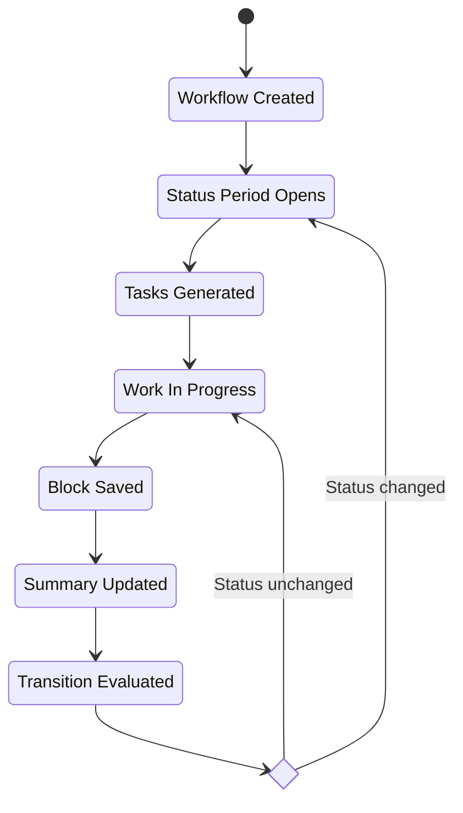
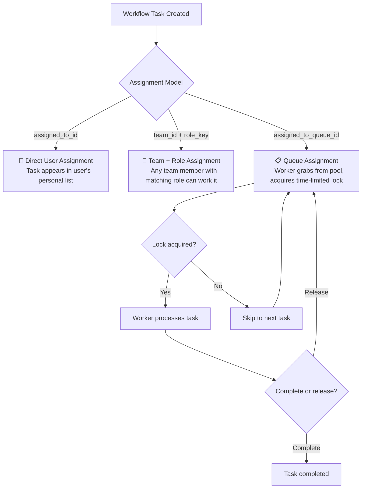
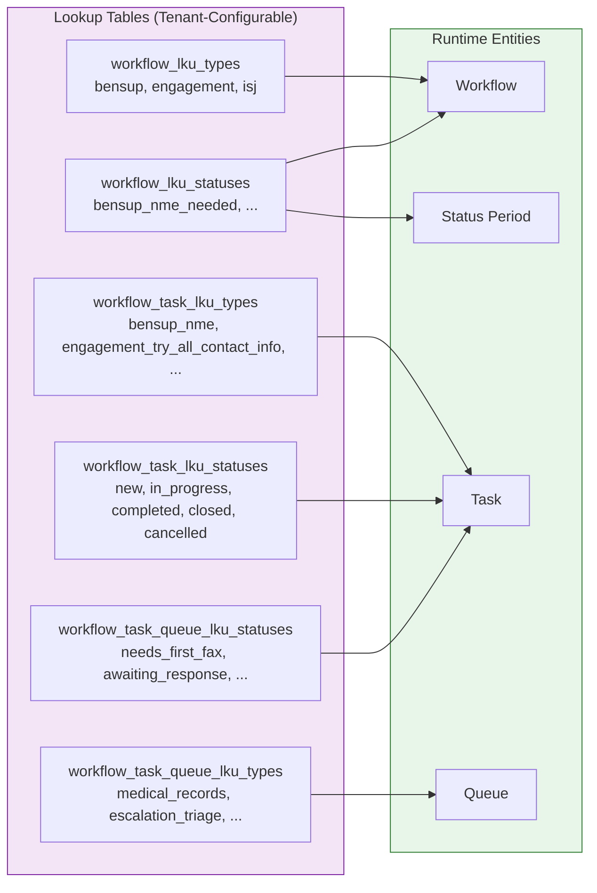
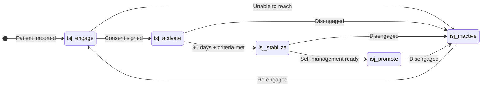
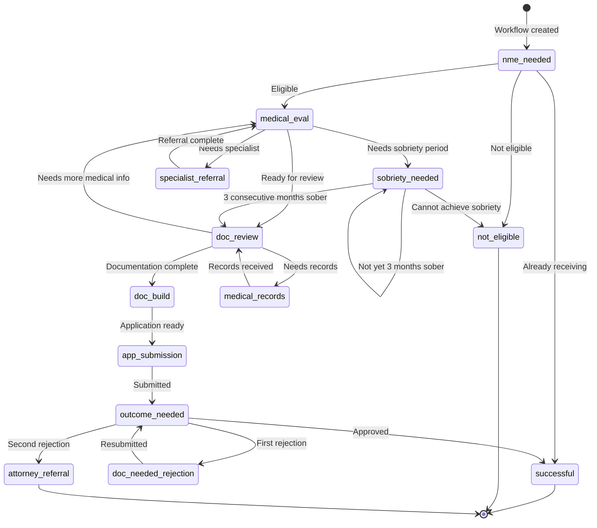
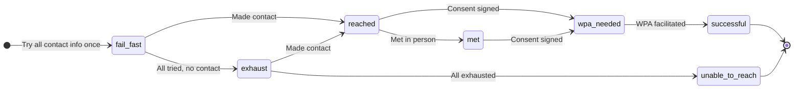

# Workflows

## Why This Architecture Exists

Healthcare coordination is messy. A single patient might need benefits support, engagement outreach, medical records retrieval, and ongoing health checks — all happening simultaneously, all involving different staff, all requiring auditability for compliance. Traditional task-list approaches crumble under this reality: they can't answer questions like "how long did this patient spend stuck in the sobriety monitoring phase?" or "which care team is bottlenecked on medical evaluations?"

The workflow system exists to solve three problems that simpler approaches can't:

1. **Temporal auditability.** In healthcare, you don't just need to know _what_ happened — you need to know _when_ it happened, _how long_ each phase lasted, and _who was responsible_ at every moment. Regulators, payers, and quality teams demand this granularity.

2. **Separation of engine from business logic.** Every healthcare organization runs slightly different care processes. One company's benefits support workflow may have 13 statuses with conditional branching. Another might have 5. The system must support both without code changes to the engine.

3. **Coordinated multi-role work.** A single workflow might involve field personnel doing in-person outreach, a nurse practitioner performing medical evaluations, a SOAR specialist filing applications, and a medical records team faxing facilities. Each role sees only their work, but the system must orchestrate all of it toward a shared goal.

The architecture answers these problems by splitting into two layers:

1. **Core** provides the workflow engine (the state machine, task management, temporal tracking, and queue infrastructure)
2. **Custom Tenant** code provides the business-specific implementations (statuses, transition rules, task types, and data capture forms).

Core knows nothing about benefits support or engagement — it just knows how to move a workflow through statuses and generate tasks. The tenant code knows everything about the care process but delegates all orchestration mechanics to Core.

---

## What Is a Workflow?

Imagine a new patient, Maria, needs support from the Acme Health Services (AHS) company. The system creates an **Patient Status Journey (PSJ)** workflow for her — a long-running container that will track her entire progression through care. She starts in the `engage` status, meaning the team's first job is to make contact.

An AHS care guide (Guide) calls Maria's phone numbers, visits her listed address, checks with her pharmacy. Each attempt is tracked. Eventually, they reach her. The PSJ advances to `activate`. At the same time, the system recognizes Maria might be eligible for disability benefits, so it spawns a separate **Benefits Support (bensup)** workflow. This workflow starts at `nme_needed` — someone must complete a Needs, Means, and Eligibility assessment.

The Guide completes the NME form. The system examines the results: Maria is eligible. The bensup workflow advances to `medical_evaluation_needed`, and two new tasks appear — one for the Guide to schedule the evaluation, one for the nurse practitioner to complete it. The Guide's task shows up in their action list; the nurse practitioner's shows up in theirs. Neither sees the other's tasks.

Meanwhile, back on the PSJ, Maria's consent for treatment arrives (a sentinel event from an external system). The PSJ automatically advances from `activate` to `stabilize`. Health check tasks start appearing on a monthly schedule.

This is the essence of a workflow: **a stateful container that progresses through phases, generating the right work for the right people at the right time, while recording every transition for analysis.**

### The Building Blocks

A workflow is made up of five core concepts that work together:

```
┌─────────────────────────────────────────────────────────┐
│  Workflow                                               │
│  "Maria's Benefits Support Journey"                     │
│  type: bensup │ status: medical_evaluation_needed       │
│                                                         │
│  ┌─────────────────────────────────────────────────┐    │
│  │ Status Periods (temporal audit trail)           │    │
│  │                                                 │    │
│  │  ┌────────────────┐    ┌──────────────────────┐ │    │
│  │  │ nme_needed     │───►│ medical_eval_needed  │ │    │
│  │  │ Jan 5 – Jan 12 │    │ Jan 12 – present     │ │    │
│  │  └────────────────┘    └──────────────────────┘ │    │
│  └─────────────────────────────────────────────────┘    │
│                                                         │
│  ┌─────────────────────────────────────────────────┐    │
│  │ Tasks (actionable work items)                   │    │
│  │                                                 │    │
│  │  ✓ Complete NME assessment (Guide) - completed  │    │
│  │  ○ Schedule medical evaluation (Guide) - new    │    │
│  │  ○ Complete medical evaluation (PNP) - new      │    │
│  └─────────────────────────────────────────────────┘    │
└─────────────────────────────────────────────────────────┘
```

- **Workflow** — The root container. Tracks type, current status, and belongs to a patient and organization.
- **Workflow Status Period** — A temporal record. Every time the workflow changes status, the current period closes (gets an `end_at`) and a new one opens (with a `start_at`). This creates an unbroken audit trail of exactly how long the workflow spent in each phase.
- **Workflow Task** — A unit of work within the workflow. Assigned to a user, a team role, or a queue. Has its own lifecycle (`new` → `in_progress` → `completed`).
- **Block** — A snapshot of data captured when a task is completed (e.g., the answers from the NME form). One block per task completion, creating an append-only audit trail.
- **Summary** — A single row that accumulates all block data across the workflow's lifetime. The transition logic reads the summary to decide what happens next.

### How Workflows Differ from Simple Task Lists

A task list says: "Here are 10 things to do." A workflow says: "Here is where this patient is in their care journey, here is what needs to happen next based on everything that's happened so far, and here is exactly who should do it."

The critical difference is **status-driven task generation**. Tasks aren't created upfront — they emerge as the workflow progresses. When the bensup workflow enters `sobriety_needed`, the system creates a sobriety determination task that doesn't start for 30 days (the patient needs time between assessments). When it enters `documentation_build_needed`, three tasks appear simultaneously for different roles. The workflow is the brain; tasks are the hands.

---

## How It Works

### Creating a Workflow

Every workflow begins as an atomic database transaction. Core creates the workflow record and its first status period; the tenant layer appends domain-specific steps (like creating a summary row and the first tasks).

```elixir
# Core provides the skeleton
Core.Workflows.create_workflow_multi(%{
  org_id: org_id,
  patient_id: patient_id,
  type_key: "bensup",
  status_key: "bensup_nme_needed",
  start_why: "Bensup workflow created"
})
# Returns an Ecto.Multi — not yet executed

# Tenant appends domain steps, then commits everything atomically
|> Multi.insert(:bensup_wf_summary, &create_summary/1)
|> Multi.run(:first_task, &create_first_task/2)
|> Repo.transact()
```

After this transaction commits, the database contains:

1. A `workflows` row (type: `bensup`, status: `bensup_nme_needed`)
2. A `workflow_status_periods` row (status: `bensup_nme_needed`, `start_at`: now, `end_at`: nil, `is_current`: true)
3. A `wf_bensup_summaries` row (all fields nil — nothing has happened yet)
4. A `workflow_tasks` row (type: `bensup_nme`, status: `new`, assigned to the patient's care team + Guide role)

### How Tasks Are Created

When a workflow enters a new status, the status definition declares which tasks to create:

```elixir
# In AH.Bensup.BensupStatuses
def medical_evaluation_needed(reason \\ nil) do
  %{
    key: "bensup_medical_evaluation_needed",
    reason: reason,
    name: "Medical Evaluation Needed",
    tasks: [
      BensupTasks.schedule_medical_evaluation(),  # for the Guide
      BensupTasks.medical_evaluation_needed()      # for the PNP
    ],
    display_order: 2
  }
end
```

Each task definition specifies a type key, a role, instructions, and weight. When `create_next_tasks` runs, it iterates over this list and calls [`Core.Workflows.create_workflow_patient_task/1`](../../apps/core/lib/core/workflows/workflows.ex:61), which:

1. Looks up the workflow to get `org_id` and `patient_id`
2. Looks up the task type to get default instructions
3. Gets the patient's care team for assignment
4. Calculates task weights from tags
5. Inserts the task, creates an assignment period, optionally creates a queue status period, and writes a history record — all in one transaction

Tasks can also be created by:

- **User action** — a clinician creates an ad-hoc task from the UI
- **Sentinel events** — an external event (hospital admission, consent signature) triggers task creation
- **Scheduled workers** — e.g., monthly health check tasks

### Moving Through Statuses: The save_workflow_block Pipeline

The heart of the system is a 10-step transactional pipeline that runs every time a user completes a task:

```
Multi.new()
│
├── 1. put(:params)              — Stash the incoming form data
├── 2. one(:current_task)        — Fetch the task being completed
├── 3. one(:wf_summary)          — Fetch the current summary
├── 4. insert(:block)            — Save a block (outcome snapshot)
├── 5. update(:update_wf)        — Merge block data into the summary
├── 6. run(:new_status)          — Compute next status from updated summary
├── 7. run(:move_to_new_status)  — If changed: close old period, open new one
├── 8. run(:close_current_task)  — Complete the current task
├── 9. run(:close_other_tasks)   — Close remaining tasks (on status change)
└── 10. run(:create_next_tasks)  — Create tasks for the new status
```

All 10 steps execute in a single database transaction. If any step fails, everything rolls back — the workflow never ends up in an inconsistent state.

The transition logic (step 6) examines the **updated summary** to decide what happens next. This is a `case` statement dispatching on the current status:

```elixir
def new_status_ms(_repo, %{bensup_wf_summary: prev_wf, update_bensup_wf: wf}) do
  result = case prev_wf.workflow.status_key do
    "bensup_nme_needed" -> handle_status_from_bensup_nme(prev_wf, wf)
    "bensup_medical_evaluation_needed" -> handle_status_from_medical_evaluation(prev_wf, wf)
    # ... one clause per status
  end
  {:ok, result}
end
```

Each handler uses `cond` to check accumulated summary fields and return the appropriate next status. If the status doesn't change (e.g., partial data submitted), the workflow stays put and tasks remain open.

### The PSJ: A Special Workflow

The Patient Status Journey is unlike other workflows. It's created at patient import time, never closes, and advances via sentinel events rather than task forms:

```elixir
# When consent_for_treatment event fires:
def advance_to_activate(patient_id) do
  case get_isj_workflow(patient_id) do
    nil -> {:error, :no_isj_workflow}
    workflow ->
      Core.Workflows.move_to_new_status(
        workflow,
        IndividualJourneyStatuses.activate("Consent for treatment signed")
      )
  end
end
```

The PSJ progresses through the high level phases that a person can be in during their relationship with the MCO. For example: `engage` → `activate` → `stabilize` → `promote` → (or `inactive` at any point). Other workflows (bensup, engagement) run as children alongside it. The PSJ is the patient's overall journey; the others are specific care processes within that journey.

### The "Super Task" Pattern

Not every care process needs a full workflow. Medical records retrieval, for example, doesn't have branching phases or accumulating state — it has _n_ independent facilities, each going through the same repetitive lifecycle (fax → wait → follow-up → receive). For these cases, the system uses **super tasks**: workflow tasks with a dedicated backing table that carries richer state than a standard task can hold.

```
PSJ Workflow (status: "isj_activate")
├── WorkflowTask (type: "medical_records_request") → medical_records_requests row (Facility A)
├── WorkflowTask (type: "medical_records_request") → medical_records_requests row (Facility B)
└── WorkflowTask (type: "medical_records_request") → medical_records_requests row (Facility C)
```

Each task sits in a queue. A specialist grabs one, sends a fax, advances the queue status, and releases it. The backing table tracks attempt dates, response files, and resolution. No blocks, no summaries, no transition logic — just a task with extra state.

---

## Data Architecture

### Workflow Lifecycle State Machine



### Task Assignment Model



### Lookup Table (LKU) System

Every configurable value in the workflow system flows through lookup tables. These tables use composite primary keys (`key` + `org_id`) so each tenant can define their own vocabulary:



---

## Analytics: What This Architecture Makes Possible

Because every status transition, task assignment, and queue interaction is recorded as a temporal period (with `start_at` and `end_at`), the system is a rich source of operational analytics. Here's what becomes queryable:

### Time-in-Status Analysis

**Question:** "How long do patients typically spend in each phase of benefits support?"

```sql
SELECT
  wsp.status_key,
  AVG(EXTRACT(EPOCH FROM (wsp.end_at - wsp.start_at)) / 86400) AS avg_days,
  PERCENTILE_CONT(0.5) WITHIN GROUP (
    ORDER BY EXTRACT(EPOCH FROM (wsp.end_at - wsp.start_at))
  ) / 86400 AS median_days,
  STDDEV(EXTRACT(EPOCH FROM (wsp.end_at - wsp.start_at)) / 86400) AS stddev_days
FROM workflow_status_periods wsp
JOIN workflows w ON w.id = wsp.workflow_id
WHERE w.type_key = 'bensup' AND wsp.end_at IS NOT NULL
GROUP BY wsp.status_key
ORDER BY MIN(wsp.start_at);
```

A high standard deviation in a particular status signals inconsistency — some patients breeze through while others get stuck. That's a bottleneck worth investigating.

### Bottleneck Detection

**Question:** "Where are workflows getting stuck right now?"

Count the workflows currently in each status and compare to historical throughput. If `bensup_sobriety_needed` has 40 workflows but averages only 5 completions per month, that's a 8-month backlog — a structural bottleneck.

**Question:** "Which tasks are sitting unworked the longest?"

```sql
SELECT
  wt.type_key,
  COUNT(*) AS open_count,
  AVG(EXTRACT(EPOCH FROM (NOW() - wt.start_at)) / 86400) AS avg_days_open,
  MAX(EXTRACT(EPOCH FROM (NOW() - wt.start_at)) / 86400) AS max_days_open
FROM workflow_tasks wt
WHERE wt.status_key IN ('new', 'in_progress')
  AND wt.is_deleted = false
GROUP BY wt.type_key
ORDER BY avg_days_open DESC;
```

### Workload Distribution

**Question:** "Is work evenly distributed across the team?"

Because every task assignment is tracked with temporal periods (`workflow_task_assignment_periods`), you can calculate:

- **Tasks per team member** — are some people overloaded?
- **Average time-to-first-touch** — how long after assignment does someone start working?
- **Reassignment rate** — how often are tasks bounced between people? (High rates suggest poor initial routing)

### Queue Health Metrics

For queue-based work (medical records, escalations), the temporal records enable:

- **Queue depth over time** — is the queue growing or shrinking?
- **Average time-in-queue** — how long before someone grabs a task?
- **Lock-to-completion time** — once grabbed, how long to finish?
- **Abandon rate** — how often do workers grab a task and then release it without completing?

### Workflow Outcome Analysis

**Question:** "What percentage of benefits support workflows succeed vs. fail, and where do they fail?"

```sql
SELECT
  w.status_key AS terminal_status,
  COUNT(*) AS count,
  ROUND(COUNT(*) * 100.0 / SUM(COUNT(*)) OVER (), 1) AS pct
FROM workflows w
WHERE w.type_key = 'bensup'
  AND w.status_key IN ('bensup_successful', 'bensup_not_eligible', 'bensup_attorney_referral')
GROUP BY w.status_key;
```

Combined with time-in-status data, you can calculate **expected time to completion** for workflows currently in progress — useful for setting patient expectations and staffing plans.

### Transition Pattern Analysis

**Question:** "What are the most common paths through the bensup workflow?"

By querying the sequence of status periods per workflow, you can build a Sankey diagram of how patients actually flow through the system. If 60% of patients follow the happy path but 25% loop back from documentation review to medical evaluation, that loop is worth optimizing.

### SLA Monitoring

With `due_at` on tasks and `start_at`/`end_at` on status periods:

- **Overdue task count** — tasks past their due date
- **SLA compliance rate** — percentage of tasks completed before due date
- **Days-to-breach** — for open tasks, how many days until SLA violation?

---

## Workflow Types at Firsthand

### Individual Status Journey (PSJ)

The PSJ is the **master workflow** — one per patient, created at import, never closed. It represents the overall arc of the patient's relationship with Firsthand.



The PSJ doesn't generate its own tasks through the block/summary pipeline. Instead, other workflows and sentinel events drive its transitions, and tasks from various workflow types (bensup tasks, engagement tasks, health checks, medical records requests) are all attached to the PSJ or its sibling workflows.

### Benefits Support (bensup)

A complex, branching workflow for securing disability benefits.



### Engagement

A linear workflow for making first contact and obtaining consent.



---

## Schema Reference

Schema files live in [`apps/core/lib/core/workflows/`](../../apps/core/lib/core/workflows/):

| Schema                                                                                                  | Purpose                                             |
| ------------------------------------------------------------------------------------------------------- | --------------------------------------------------- |
| [`Workflow`](../../apps/core/lib/core/workflows/workflow.ex)                                            | Root workflow entity                                |
| [`WorkflowLkuType`](../../apps/core/lib/core/workflows/workflow_lku_type.ex)                            | Workflow type lookup (composite PK: key + org_id)   |
| [`WorkflowLkuStatus`](../../apps/core/lib/core/workflows/workflow_lku_status.ex)                        | Workflow status lookup (composite PK: key + org_id) |
| [`WorkflowStatusPeriod`](../../apps/core/lib/core/workflows/workflow_status_period.ex)                  | Temporal record of time spent in each status        |
| [`WorkflowTask`](../../apps/core/lib/core/workflows/workflow_task.ex)                                   | Task entity with assignment and queue support       |
| [`WorkflowTaskLkuType`](../../apps/core/lib/core/workflows/workflow_task_lku_type.ex)                   | Task type lookup                                    |
| [`WorkflowTaskLkuStatus`](../../apps/core/lib/core/workflows/workflow_task_lku_status.ex)               | Task status lookup                                  |
| [`WorkflowTaskQueue`](../../apps/core/lib/core/workflows/workflow_task_queue.ex)                        | Queue for group-assigned tasks                      |
| [`WorkflowTaskTagValue`](../../apps/core/lib/core/workflows/workflow_task_tag_value.ex)                 | Task tag definitions (with weights)                 |
| [`WorkflowTaskTag`](../../apps/core/lib/core/workflows/workflow_task_tag.ex)                            | Task ↔ tag value join                               |
| [`WorkflowComment`](../../apps/core/lib/core/workflows/workflow_comment.ex)                             | Comments on workflow progress                       |
| [`WorkflowEvent`](../../apps/core/lib/core/workflows/workflow_event.ex)                                 | Significant events during workflow execution        |
| [`WorkflowTaskHistory`](../../apps/core/lib/core/workflows/workflow_task_history.ex)                    | Complete audit log of task changes                  |
| [`WorkflowTaskAssignmentPeriod`](../../apps/core/lib/core/workflows/workflow_task_assignment_period.ex) | Temporal record of task assignments                 |

**Context module:** `Core.Workflows` — see [`workflows.ex`](../../apps/core/lib/core/workflows/workflows.ex) for all public functions.

**Related documentation:**

- [Workflow System Guide](./workflow-system-guide.md) — Deep technical walkthrough with code examples
- [Queues](./queues.md) — Role-based work distribution details
